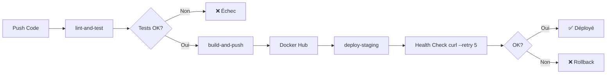

# VitalSync — Suivi médical et sportif

Application de suivi médical et sportif containerisée avec pipeline CI/CD complet.

## Description

VitalSync est une application full-stack composée de :
- **Backend** : API REST Node.js/Express (port 3000)
- **Frontend** : Interface HTML servie par Nginx (port 80)
- **Base de données** : PostgreSQL 15

## Prérequis

- Docker >= 24.x
- Docker Compose >= 2.x
- Node.js >= 20.x (développement local)
- kubectl (déploiement Kubernetes)

## Installation rapide

```bash
# 1. Cloner le dépôt
git clone https://github.com/Badis91/vitalsync.git
cd vitalsync

# 2. Configurer les variables d'environnement
cp .env.example .env
# Éditer .env avec vos valeurs

# 3. Lancer avec Docker Compose
docker-compose up -d
```

## Commandes Docker Compose

```bash
# Démarrer tous les services
docker-compose up -d

# Voir les logs
docker-compose logs -f

# Voir les logs d'un service
docker-compose logs -f backend

# Arrêter les services
docker-compose down

# Arrêter et supprimer les volumes
docker-compose down -v

# Reconstruire les images
docker-compose build --no-cache

# Vérifier l'état des services
docker-compose ps
```

## Endpoints API

| Méthode | Route             | Description                  |
|---------|-------------------|------------------------------|
| GET     | `/health`         | Vérification de santé        |
| GET     | `/api/activities` | Liste des activités sportives |

## Pipeline CI/CD



### Détail des jobs

1. **lint-and-test** : Exécute ESLint + Jest avec couverture de code
2. **build-and-push** : Build multi-stage Docker et push sur Docker Hub avec tag SHA court
3. **deploy-staging** : Déploiement SSH + health check avec 5 retries

## Architecture Docker

```
vitalsync-network (bridge)
├── vitalsync-frontend (nginx:1.25-alpine) → port 80
│   └── proxy /api/* → backend:3000
├── vitalsync-backend (node:20-alpine) → port 3000
│   └── depends on: database (healthy)
└── vitalsync-database (postgres:15-alpine)
    └── volume: postgres_data
```

## GitFlow

```
main          ←── releases production
  └── develop ←── intégration continue
        ├── feature/docker-setup
        ├── feature/add-endpoint
        └── feature/update-health
```

## Kubernetes

```bash
# Appliquer les manifests
kubectl apply -f k8s/secret.yaml
kubectl apply -f k8s/deployment.yaml
kubectl apply -f k8s/service.yaml
kubectl apply -f k8s/ingress.yaml

# Vérifier le déploiement
kubectl get pods
kubectl get services
kubectl get ingress
```

## Secrets GitHub à configurer

Dans **Settings → Secrets and variables → Actions** :

| Secret           | Description                    |
|------------------|--------------------------------|
| `DOCKER_USERNAME`| Nom d'utilisateur Docker Hub   |
| `DOCKER_PASSWORD`| Token d'accès Docker Hub       |
| `STAGING_HOST`   | IP/hostname du serveur staging |
| `STAGING_USER`   | Utilisateur SSH staging        |
| `STAGING_SSH_KEY`| Clé privée SSH                 |

## Auteur

Projet réalisé dans le cadre de l'examen EFREI — Épreuve E6 CI/CD conteneurisée.

## Variables d'environnement

| Variable            | Description               | Exemple          |
|---------------------|---------------------------|------------------|
| `POSTGRES_DB`       | Nom de la base de données | vitalsync        |
| `POSTGRES_USER`     | Utilisateur PostgreSQL    | vitalsync_user   |
| `POSTGRES_PASSWORD` | Mot de passe PostgreSQL   | SecurePass123!   |
| `NODE_ENV`          | Environnement Node.js     | production       |
